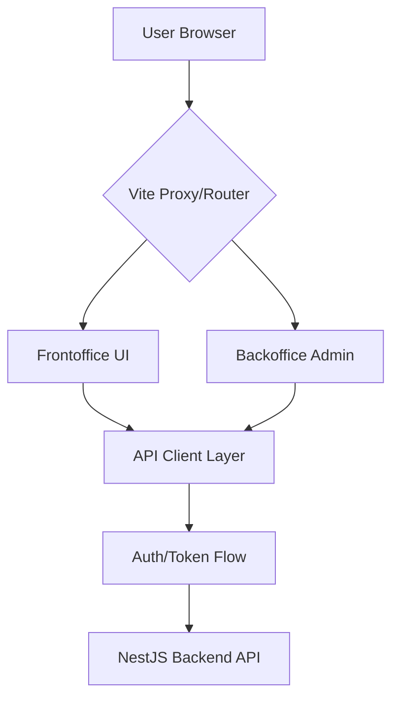

  
  <h1>🚀 AlgoArena | Frontend</h1>
  <p><strong>The ultimate competitive programming platform for mastering algorithms with style.</strong></p>
  <div align="center">
    
    
    
  </div>
</div>


## Table of Contents
- [About The Project](#about-the-project)
- [Key Features](#key-features)
- [Architecture Overview](#architecture-overview)
- [Tech Stack](#tech-stack)
- [Project Structure](#project-structure)
- [Prerequisites](#prerequisites)
- [Installation And Setup](#installation-and-setup)
- [Available Scripts](#available-scripts)
- [Environment Variables](#environment-variables)
- [Pages And Routes](#pages-and-routes)
- [Screenshots](#screenshots)
- [Related Repositories](#related-repositories)
- [Team](#team)
- [License](#license)

## About The Project
AlgoArena is a competitive programming platform designed to help learners and professionals practice algorithmic problem solving in a structured, engaging environment. It combines coding challenges, ranking progression, and real submission feedback to support continuous skill growth.

This repository contains the frontend application built with React, Vite, and Chakra UI. It delivers the full user interface for challenge solving, profile and leaderboard experiences, battle views, and the administrative dashboard used to manage platform operations.

The product is built for students, developers preparing for interviews, and competitive programmers who need a reliable space to practice under realistic constraints. It also supports administrators with tooling for analytics, challenge workflows, and system visibility.

What makes the experience strong is the integration of AI-assisted flows and sandboxed code execution from the backend, combined with gamification (XP, rank progress, streaks) and modern UX patterns.

### 🔐 Authentication & Security
- 🛡️ **Advanced Flow**: Secure sign-in and sign-up with reCAPTCHA v3 protection
- 🌐 **Social Auth**: OAuth2 integration for painless GitHub & Google login
- 🔑 **Recovery**: Full password reset and account verification workflows
- 🚔 **Security**: Role-based access control (RBAC) ensuring admin integrity
- 🚪 **Guards**: Smart navigation guards protecting the challenge ecosystem

### 🧩 Challenge Experience
- 🏗️ **Workspaces**: Dynamic challenge discovery and interactive workspaces
- ✍️ **Code Editor**: Premium Monaco Editor integration with IDE-grade features
- ⚖️ **Judge System**: Real-time evaluation through high-performance judge APIs
- 🤖 **AI Support**: Intelligent feedback and judge insights powered by LLMs
- ⏱️ **Live Tracking**: Real-time timer, execution states, and solution persistence

### 🏆 Competitive Arena
- ⚔️ **Battles**: Global battle matchmaking and live arena interfaces
- 📈 **Leaderboard**: Real-time global standings and skill-based rankings
- ⚡ **Speedrun**: High-stakes speed challenges with onboarding placement flow

### 👤 Profile & Dashboard
- 🖼️ **Identity**: Comprehensive user profiles with 2FA security controls
- 🎖️ **Progression**: Automated rank stats, XP gains, and performance history
- 🎨 **UX**: Seamless theme switching (Dark/Light) and accessibility first design

### 🔧 Admin Powerhouse
- 📊 **Analytics**: High-density dashboards with Chart.js visualization
- 🛠️ **Management**: Full-lifecycle challenge and user orchestration tools
- 📜 **Audit Logs**: Complete activity transparency with rollback capabilities
- 📡 **Monitoring**: Real-time Docker sandbox telemetry and system health

## 🏗 Architecture Overview



## Tech Stack
| Technology | Version | Purpose |
|---|---|---|
| React | 19.2.0 | UI framework |
| React DOM | 19.2.0 | Browser rendering |
| React Router DOM | 7.13.0 | Client-side routing |
| Chakra UI | 2.8.2 | Component system and design primitives |
| Chakra Icons | 2.2.4 | UI icons |
| Vite | 7.3.1 | Dev server and build tool |
| @vitejs/plugin-react | 5.1.1 | React plugin for Vite |
| Monaco Editor React | 4.7.0 | Code editor embedding |
| Chart.js | 4.5.1 | Charting engine |
| react-chartjs-2 | 5.3.1 | React chart bindings |
| Framer Motion | 12.30.0 | Animations |
| Lucide React | 0.577.0 | Icon library |
| React Icons | 5.6.0 | Additional icon packs |
| Type packages (@types/react, @types/react-dom) | 19.2.5 / 19.2.3 | TypeScript type support |
| Tailwind CSS (tooling) | 4.1.18 | Utility styling pipeline |

## Project Structure
```text
src/
+-- accessibility/          # Accessibility context, hooks, global UI
+-- assets/                 # Static app assets
+-- components/             # Shared reusable components (charts, layout UI, monitor card)
+-- editor/                 # Editor-related reusable components
+-- hooks/                  # Generic custom hooks
+-- layout/                 # Public/Admin layout shells
+-- pages/
|   +-- Backoffice/         # Admin pages (Dashboard, Challenges, ActivityLogs, etc.)
|   +-- Frontoffice/        # Auth, challenges, battles, leaderboard, profile, speed challenge
+-- sections/               # Landing page sections
+-- services/               # API client + domain service wrappers
+-- shared/                 # Shared contexts/loaders/skeletons/cursor
+-- theme/                  # Chakra theme extension
+-- App.jsx                 # Root routing and guards
+-- main.jsx                # App bootstrap and providers

public/
+-- logo_algoarena.png      # Project logo
```

## Prerequisites
- Node.js (LTS recommended, Node 18+)
- npm (project uses `package-lock.json`)
- Running backend API (default target `http://localhost:3000` through Vite proxy)
- Browser with JavaScript enabled

## Installation And Setup
1. Clone repository
```bash
git clone git@github.com:Salemdiber/Esprit-PI-4twin4-2026-AlgoArena-FrontEnd.git
cd Esprit-PI-4twin4-2026-AlgoArena-FrontEnd
```

2. Install dependencies
```bash
npm install
```

3. Configure environment
```bash
# no .env.example is present, create .env manually
```

4. Start development server
```bash
npm run dev
```

5. Open app
```text
http://localhost:5173
```

## Available Scripts
| Script | Command | Description |
|---|---|---|
| Development | `npm run dev` | Starts Vite dev server |
| Build | `npm run build` | Builds production assets |
| Lint | `npm run lint` | Runs ESLint |
| Preview | `npm run preview` | Serves built output locally |

## Environment Variables
| Variable | Required | Default | Description |
|---|---|---|---|
| `VITE_RECAPTCHA_SITE_KEY` | Yes (for auth forms) | None | Google reCAPTCHA site key used in sign-in and sign-up pages |
| `VITE_API_URL` | Optional | `/api` | API base URL used by service clients; if omitted, frontend calls proxied `/api` |

## Pages And Routes
| Route | Page | Description | Access |
|---|---|---|---|
| `/` | LandingPage | Marketing/home entry page | Public |
| `/signin` | SignIn | User login form | Public |
| `/signup` | SignUp | User registration form | Public |
| `/auth/callback` | OAuthCallbackPage | OAuth callback handler | Public |
| `/forgot-password` | ForgotPasswordPage | Request password reset | Public |
| `/email-sent` | EmailSentPage | Reset-email confirmation | Public |
| `/reset-password/:token` | ResetPasswordPage | Reset password with token | Public |
| `/reset-success` | ResetSuccessPage | Reset completion page | Public |
| `/reset-expired` | ResetExpiredPage | Expired reset link page | Public |
| `/battles` | BattleListPage | Browse battles | Public |
| `/battles/:id` | ActiveBattlePage | Active battle interface | Public |
| `/battles/:id/summary` | BattleSummaryPage | Battle result summary | Public |
| `/challenges` | ChallengesListPage | Browse coding challenges | Authenticated |
| `/challenges/:id` | ChallengePlayPage | Solve challenge in editor | Authenticated |
| `/leaderboard` | LeaderboardPage | Ranking and standings | Public |
| `/profile` | ProfilePage | User profile and account settings | Authenticated |
| `/profile/2fa-setup` | TwoFactorSetupPage | Two-factor setup flow | Authenticated |
| `/speed-challenge` | SpeedChallengePage | Initial speed challenge / placement flow | Authenticated |
| `/admin` | Dashboard | Admin dashboard home | Admin/Organizer |
| `/admin/users` | Users | User administration | Admin/Organizer |
| `/admin/battles` | Battles | Battle management | Admin/Organizer |
| `/admin/challenges` | Challenges | Challenge management | Admin/Organizer |
| `/admin/ai-logs` | AILogs | AI-related logs | Admin/Organizer |
| `/admin/leaderboards` | Leaderboards | Leaderboard admin tools | Admin/Organizer |
| `/admin/analytics` | Analytics | Analytics dashboards | Admin/Organizer |
| `/admin/system-health` | SystemHealth | Health status page | Admin/Organizer |
| `/admin/settings` | Settings | Platform settings | Admin/Organizer |
| `/admin/sessions` | Sessions | Session monitoring | Admin/Organizer |
| `/admin/activity-logs` | ActivityLogs | Audit/activity logs | Admin/Organizer |
| `/admin/profile` | Profile | Admin profile | Admin/Organizer |
| `/admin/add-admin` | AddAdmin | Add admin user flow | Admin/Organizer |
| `/notfound` | NotFoundPage | Not found page | Public |

## Screenshots
> Screenshots will be added here. To contribute screenshots, run the application and capture the key pages.

## Related Repositories
| Repository | URL |
|---|---|
| Backend API | https://github.com/Salemdiber/Esprit-PI-4twin4-2026-AlgoArena-BackEnd |
| Frontend App | https://github.com/Salemdiber/Esprit-PI-4twin4-2026-AlgoArena-FrontEnd |

## Team
Contributors discovered from git history:
- Adem Miladi
- Draouil Rayssen
- MDadem
- Salem Diber
- Salemdiber
- slim00077

## License
No dedicated `LICENSE` file is present in this repository. Package metadata indicates `private: true`.
