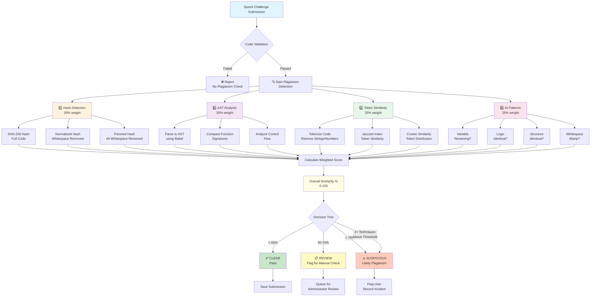
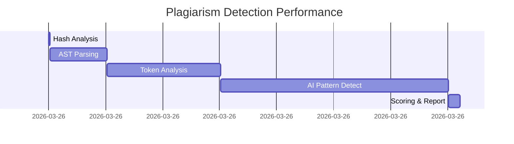
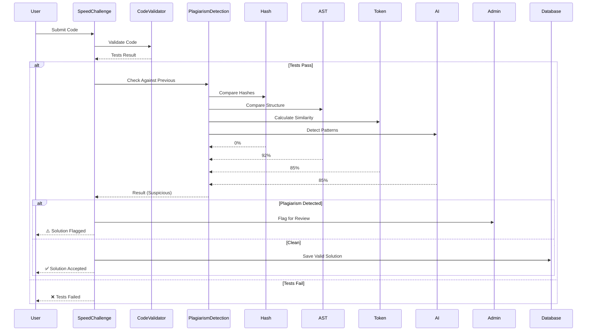

# 🔍 Plagiarism Detection System - Visual Architecture



---

## Detection Flow for Each Technique

### 1️⃣ Hash-Based Detection (Fast ⚡)
```
Submitted Code: function solve(n) { return n * 2; }
Reference Code: function solve(n) { return n * 2; }
          ↓
SHA-256 Hash          → Same = 100%
Normalized Hash       → Same = 95%
Trimmed Hash          → Same = 90%
          ↓
Result: MATCH ✅ Exact copy detected
```

### 2️⃣ AST Analysis (Structure ⚡⚡)
```
Submitted: function verify(x) { let s=0; for(let i=0;i<x;i++) s+=i; return s; }
Reference: function compute(num) { let sum=0; for(let j=0;j<num;j++) sum+=j; return sum; }
           ↓
Parse both to AST
           ↓
Compare:
- Function Count: 1 vs 1 ✓
- Parameters: 1 vs 1 ✓
- Loops: for vs for ✓
- Conditionals: 0 vs 0 ✓
           ↓
Structure Similarity: 92%
```

### 3️⃣ Token Similarity (Algorithm ⚡⚡)
```
Submitted after tokenization:
[const, fib, =, n, =>, n, <=, 1, return, n, return, fib, ...]

Reference after tokenization:
[const, fibonacci, =, x, =>, x, <=, 1, return, x, return, fibonacci, ...]

Common tokens: for, if, return, <=, etc.
Common pool size: 18
Total unique: 24
Jaccard Index: 18/24 = 75%
Cosine Similarity: 82%
Average: 78%
           ↓
Result: Similar algorithm detected
```

### 4️⃣ AI Pattern Detection (Intelligent 🤖)
```
Pattern 1: Variable Renaming
   Submitted vars: [verify, x, s, i]
   Reference vars: [compute, num, sum, j]
   Structure: IDENTICAL
   → Confidence: 85% = SUSPICIOUS

Pattern 2: Logic Identical
   After variable substitution:
   Submitted:  VAR VAR = NUM; for(VAR = NUM; VAR < VAR; VAR++) VAR += VAR; return VAR;
   Reference:  VAR VAR = NUM; for(VAR = NUM; VAR < VAR; VAR++) VAR += VAR; return VAR;
   → Match: 100% = HIGHLY SUSPICIOUS

Pattern 3: Structure Identical
   Code structure: F C R F C R F
   Both have: Function, Conditional, Return pattern
   → Confidence: 88%

Pattern 4: Whitespace Manipulation
   Clean comparison (no whitespace):
   Submitted:  varconstfib=n=>n<=1returnnreturnfib...
   Reference:  varconstfib=n=>n<=1returnnreturnfib...
   → Same: 99% = EXACT
```

---

## Scoring Example: Variable Renaming Case

```
Input:
  Reference: function solution(n) { let sum=0; for(let i=0;i<n;i++) sum+=i; return sum; }
  Submitted: function solve(x) { let total=0; for(let j=0;j<x;j++) total+=j; return total; }

Technique Scores:
  1. Hash:     0% (different variable names)
  2. AST:      92% (identical structure)
  3. Token:    85% (same algorithm pattern)
  4. AI:       85% (variable renaming detected)

Weighted Average:
  (0 × 0.20) + (92 × 0.30) + (85 × 0.25) + (85 × 0.25)
  = 0 + 27.6 + 21.25 + 21.25
  = 70.1%

Result: 70% overall → REVIEW or SUSPICIOUS ⚠️
```

---

## Performance Metrics



**Total per Comparison: ~350ms**
**Bulk Check (30 submissions): ~3 minutes for all pairs**

---

## Detection Confidence Heatmap

```
Similarity %    Clear ✅          Review 📋         Suspicious ⚠️
70-80%         Variable Renaming  Use AI Check    Consider Context
80-90%         Unlikely          Monitor         Likely Plagiarism
90-100%        Very Rare         High Alert      Definite Match
```

---

## Integration with Speed Challenge Flow


